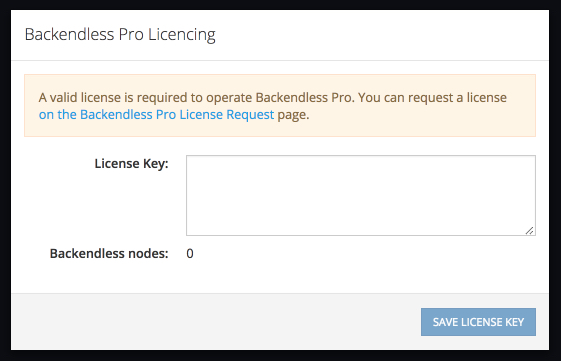

# Backendless Pro
This is a repo for the distribution of Backendless Pro - the self-hosted version of the product. Backendless Pro is a complete technology stack, it includes all Backendless features without any limitations whatsoever. Backendless Pro is based on the docker architecture and thus can run in any environment supported by Docker. Backendless Pro consists of multiple components, such as a web server, the database, application engine, etc. Each component runs as a separate docker image thus allowing for horizontal scalability of each type of component. All Backendless docker images are published into [DockerHub](https://hub.docker.com/u/backendless/).

## Getting Started
To get started:
1. Download the `quickstart` [archive](https://github.com/Backendless/BackendlessPro/archive/master.zip) and expand it into a directory. The archive contains all the management scripts for the product. 
1. Open a command prompt/terminal window and change the current directory to `/scripts` which is located in the root of the directory created from the downloaded zip. Run the following command, which will download and install all the required images:
    ```
    ./backendless_install.sh
    ```
1. When the installation script runs, it will prompt you to enter port numbers for the following Backendless components:
    * MySQL (default port - 3306)
    * MongoDB (default port - 27017)
    * Redis (default port - 6380)
    * The Backendless server, which is the app server (default port 9000) 
    * The web console server (default port 80)
    * RT (Real Time) server (default port 5000)
   Each prompt will show the default port number, to accept it, simply press **Enter**, otherwise, enter a port number.
1. When the command finishes, make sure Docker is running on your machine.
1. Run Backendless Pro using the following command:
    ```
    ./backendless_start.sh
    ```
1. During the installation you may see some errors, for example:
    ```
    [INFO] WaiterService - SQL database 'main_backendless' is not accessible. Error message: Communications link failure
    The last packet sent successfully to the server was 0 milliseconds ago. The driver has not received any packets from the server..
    Waiting for 3000 millis before retry...
    ```
    You can ignore errors like that, they occur because various product components start in random order, but eventually they auto-discover each other. Depending how fast your computer is and how much memory it has, the complete launch may take between 3 to 10 minutes. You will know it is done when you see the following message in the script output:
    ````
   [INFO] StartUpLogger - *************************************************************
   [INFO] StartUpLogger - ******************** Backendless started ********************
   [INFO] StartUpLogger - *************************************************************
   Backendless server is ready
    ````
1. Now you can open Backendless Console by navigating to `http://localhost:80` (if you specified a different port for `the web console server`, make sure to use it in the URL). If this is the first time you run Backendless Pro, you will see the following screen:</br>

1. To proceed further, you need to request an evaluation license for Backendless Pro. To do this, either use the link in the popup or open the [Backendless Pro License Request page](https://backendless.com/products/pro/license-request/), fill out and submit the form - you will receive your license key via email right away.
1. Paste the license key from the email into the `License Key` text area and click the **SAVE LICENSE KEY** button.
1. You will see the Backendless Console login screen:

1. Since this is the first time you access your installation, you will need to create a developer/admin account. To do that, click the **Register** link and fill out the registration form. This will create a Backendless account for your installation. The confirmation page will say that an email is sent to your email address, ignore it and return to the login form (which is accessible at the installation's URL `http://localhost:[PORT]`) and login to your account using the registration credentials.     
