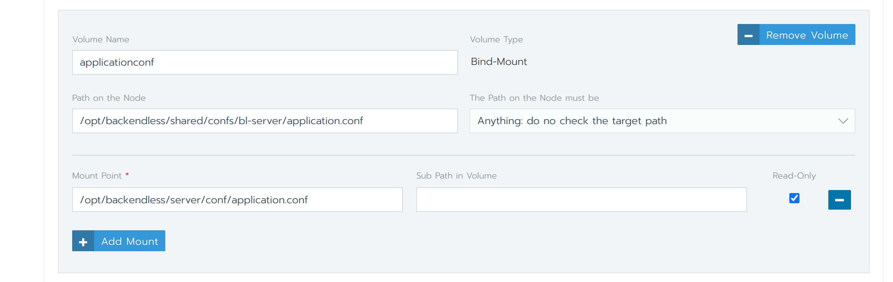
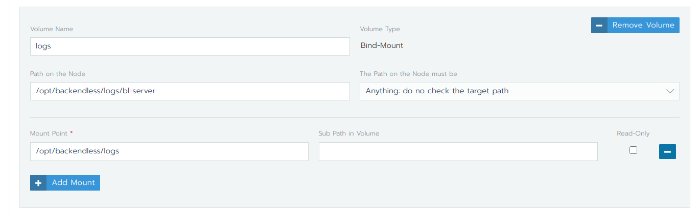
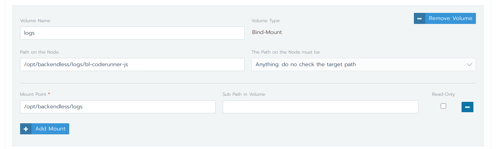

# <a name="increase_timeout">Increase bl-server request timeout</a>
* [Add mount to application.conf](#mount_application_conf)
* Edit application.conf file and change the following properties:
  - `promise.akka.actor.typed.timeout`
  - `akka.http.server.request-timeout`
  - `play.server.http.idleTimeout`
* Redeploy `bl-server`

# <a name="increase_thread">Increase number of threads for bl-server</a>
* [Add mount to application.conf](#mount_application_conf)
* Edit application.conf file and change `fixed-pool-size` property
* Redeploy `bl-server`

# <a name="mount_application_conf">Mount application.conf</a>
To get content of `application.conf` we need `kubectl` or use Rancher UI kubectl https://rancher.com/docs/rancher/v2.x/en/cluster-admin/cluster-access/kubectl/#accessing-clusters-with-kubectl-shell-in-the-rancher-ui

* Get name of any `bl-server` pod:
  ```
  kubectl get po -o wide |grep bl-server
  ```
* Execute the following command
  ```
    kubectl exec <pod-name> cat /opt/backendless/server/conf/application.conf
  ```
   Do not forget to replace the pod-name with your name
* Create file on the shared file system with name `application.conf` and content from the previous command
* Add volume mount with the following paths: 
  * path on the node `<path-of-the-shared-file-syste>/application.conf`
  * mount path: `/opt/backendless/server/conf/application.conf`
  In rancher it should look like the following:
    


# <a name="mount_log_folder_for_bl_server">Mount log folder for bl-server</a>
* Create folder on each worker node with the following path: `/opt/backendless/logs/bl-server`
* Add volume mount with the following paths:
    * path on the node `/opt/backendless/logs/bl-server`
    * mount path: `/opt/backendless/logs`
      In rancher it should look like the following:
      

# <a name="mount_log_folder_for_bl_js_coderunner">Mount log folder for bl-coderunner-js</a>
* Create folder on each worker node with the following path: `/opt/backendless/logs/bl-coderunner-js`
* Add volume mount with the following paths:
    * path on the node `/opt/backendless/logs/bl-server`
    * mount path: `/opt/backendless/logs`
      In rancher it should look like the following:
      
* Make sure that your configuration in consul `http(s)://<consul-domain-or-ip>:<port>/ui/#/dc1/kv/config/coderunner/js/loggers/file/filename/edit` is :
```
./logs/js-coderunner-%DATE%.log
```