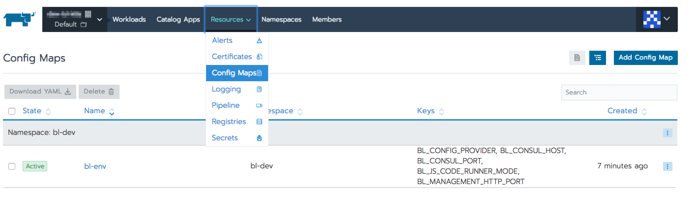

# Services setup

Before setup services, install and configure following applications:

- rancher in HA mode 

- mysql 5.7 it should contains the following config:
```
character-set-server = utf8mb4
collation-server = utf8mb4_unicode_520_ci
sql-mode = '' # empty
```

#### For Amazon RDS create parameter group and apply the following:

```
character_set_server = utf8mb4
collation_server = <leave empty>
sql-mode = NO_ENGINE_SUBSTITUTION 
log_bin_trust_function_creators = 1

```

- redis 4+ redis should be configured with `KEA` https://redis.io/topics/notifications
```
notify-keyspace-events KEA
```
- mongo 4+

###### Note: before importing an yml file, open it and make sure that there are correct mounts and the backendless version

Follow the setup guide step-by-step in the order that is provided in the doc. 
- You should have a shared file system mounted to all worker nodes to folder `/opt/backendless/shared`
- Initialize mysql DB with the following sql files https://github.com/Backendless/BackendlessPro/tree/master/scripts/mounts/mysql/init
- Add `analytics`, `application_settings`, `push_templates` databases to the mongodb
- [Initialize config map](#init_config_map)
- [Setup Consul](services/consul.md)
- [Initialize config values](services/init_config_values.md)
- [Setup Hazelcast](services/hazelcast/4.0.x-4.1.x/hazelcast-4.x.md)
- [Change configuration values](./first-configuration.md)
- [Import `bl-server`](services/yml/bl-server.yml) change image version 
  and create folder on each node by the following path `/opt/backendless/logs/bl-server` before import
- [Import `bl-taskman`](services/yml/bl-taskman.yml)  change image version
  and create folder on each node by the following path `/opt/backendless/logs/bl-taskman` before import
- [Import `bl-coderunner-java`](services/yml/bl-coderunner-java.yml) change image version before import
- [Import `bl-coderunner-js`](services/yml/bl-coderunner-js.yml) change image version before import
- [Import `bl-web-console`](services/yml/bl-web-console.yml) change image version
  and create folder on each node by the following path ` /opt/backendless/logs/bl-web-console` before import
- [Setup RT](./rt.md)
- [Setup domain](#setup_domains)
- [Setup SMTP](#setup_smtp_server)
- [Smoke test](./smoke_test.md)


### <a name="init_config_map">Initialize config map</a>
- Press `Import YAML` button

- Copy and paste [config map](services/yml/config-map.yml)
- Press `Import` button

As a result you will able to see your config in the list  


### <a name="setup_domains">Setup domains</a>
- Create domain for API for example `api.my-domain.com` make sure that it is pointed to each k8s node where `bl-server` is running. The domain should be pointed to `32300` port
- Create domain for Backendless console for example `dev.my-domain.com` make sure that it is pointed to each k8s node where `bl-web-console` is running. The domain should be pointed to `32400` port

### <a name="setup_smtp_server">Setup  SMTP</a>
Go to consul http://<k8s-node-ip>:32600/ui/#/dc1/kv/config/mail/settings/ and provide your smtp settings    

