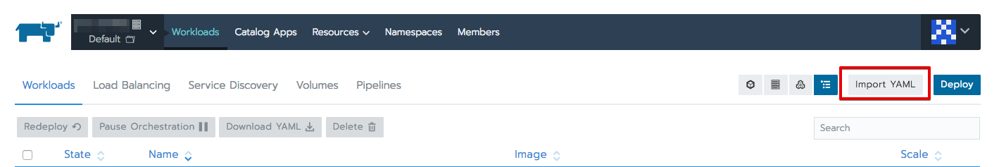
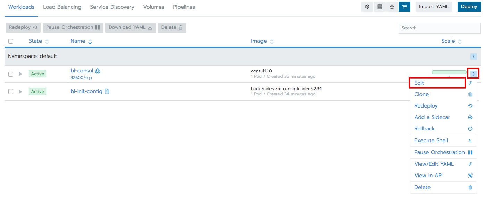
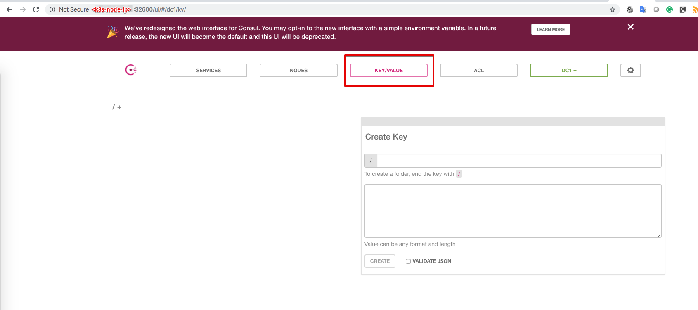

# Setup `bl-consul`
On the shared file system create folder `/opt/backendless/shared/consul/data`

## <a name="yml">Use yml file</a>
Following steps suppose that you have mounted the shared file system to each k8s node, and mount point is `/var/backendless/fs/`

- Press `Import YAML` button

- Copy and paste [bl-consul](yml/bl-consul.yml) yml file
- Press `Import` button

If you would like to change persistence volume, port, etc press `Edit` button

As a result, you will see `bl-consul` service in a list

To get access to the consul you should open port `32600` on k8s nodes

Type IP of any k8s node in the browser and port `32600` and you will able to use consul UI to manage  backendless configuration
  