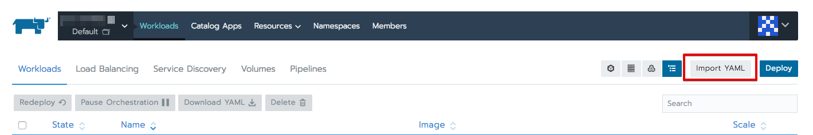

# Setup Hazelcast for k8s

To start `bl-hazelcast` we should configure hazelcast kubernetes plugin. 

We suggest to use `Kubernetes API` discovery mode. Follow the instructions below to set up your environment  

Checkout the doc https://github.com/hazelcast/hazelcast-code-samples/tree/v3.12.5/hazelcast-integration/kubernetes

1. Grant Permissions to use Kubernetes API: 

- Press `Import YAML` button

- Copy and paste [rbac.yml](../../yml/rbac.yml) yml file
- Press `Import` button

2. Setup configuration
- Go to consul ui `http://<k8s-node-ip>:32600/ui/#/dc1/kv/config/hazelcast/xml/edit`. 
- Copy content of [hazelcast.xml](hazelcast.xml) file
- Paste it as a value
- Press `Update` button
- Go to consul ui `http://<k8s-node-ip>:32600/ui/#/dc1/kv/config/hazelcast/client/xml`. 
- Copy content of [hazelcast-client.xml](hazelcast-client.xml) file
- Paste it as a value
- Press `Update` button 

3. Create `bl-hazelcast` service
- Press [Import YAML](../../img/import_yml.png) button
- Copy and paste [bl-hazelcast](yml/bl-hazelcast.yml) yml file
- Press `Import` button