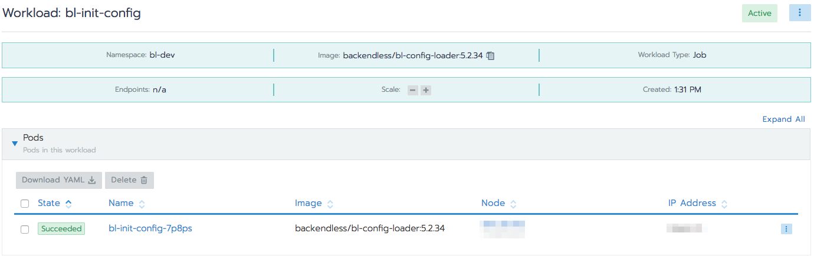
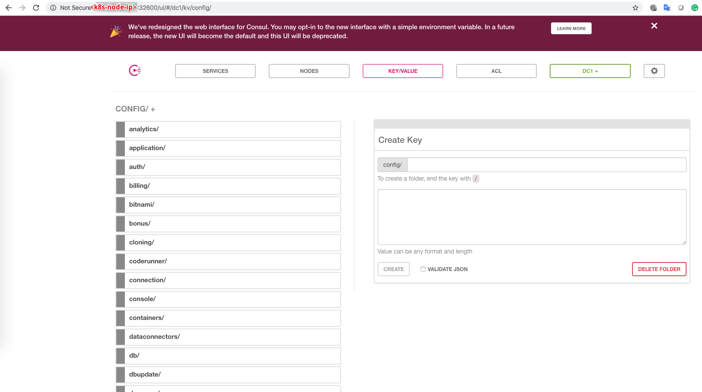

# Initialize config values
To initialize config values use [backendless/bl-config-loader](https://hub.docker.com/r/backendless/bl-config-loader/tags) container

- Press `Import YAML` button

- Copy and paste [bl-init-config](yml/bl-init-config.yml) yml file
- Press `Import` button

As a result, you will see the job in a service list, and when it finishes it will have `Succeeded` status

Go to consul ui `http://<k8s-node-ip>:32600/ui/#/dc1/kv/config/`. You should values as pictured on the following screanshot:

Now you can delete this job.